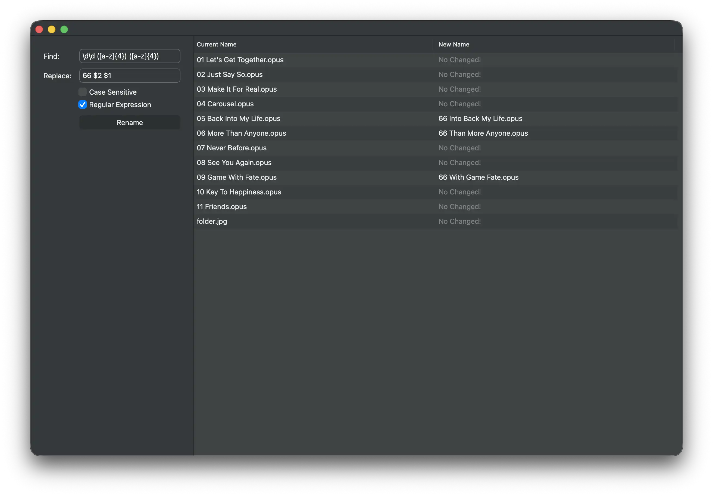

# renamer
A cross-platform batch file renaming tool written in Qt Widgets. First, build  QWINDOWKIT, and then follow the steps:

```
git clone https://github.com/tux0529/renamer.git
cd renamer
cmake -B build -S . \
  -DCMAKE_PREFIX_PATH=/path/to/qt \
  -DQWindowKit_DIR=/path/to/qwindowkit/lib/cmake/QWindowKit
cd build
make
```


## Supported Platforms

- Microsoft Windows
- Apple macOS (11+)
- GNU/Linux

## Features

Supports searching for specific characters in file names and replacing them with another string of characters. Supports deleting characters if the replacement string is left blank. Supports regular expressions.

## Dependencies

- Qt 5.12 or higher
- [QWindowKit](https://github.com/stdware/qwindowkit)

## Screenshot



## TODO

Add the feature of renaming files according to the sequence numbers in the file list.

## License

renamer is licensed under the [Apache 2.0 License](./LICENSE).
